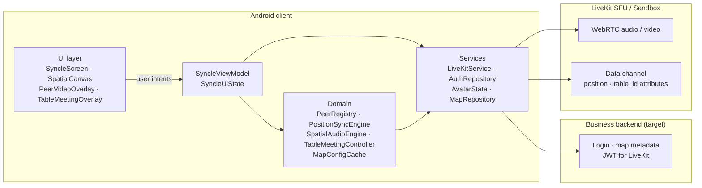
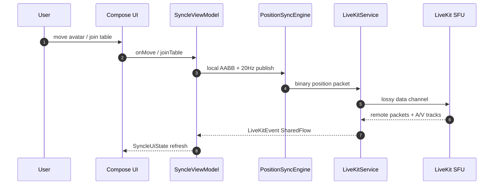

# Syncle (Spatial Workstream) — Android Client


**Languages:** [English](#english) · [中文](#中文)

---

## Architecture (overview)

End-to-end responsibilities and client layering (UDF). Diagram labels are English for tooling compatibility.





| Layer | Responsibility |
|--------|----------------|
| **UI** | Stateless Compose; world map via `MapCamera`; table join on proximity + tap |
| **ViewModel** | Single orchestrator; coroutines for sync (50ms) and lerp |
| **Domain** | Peers, spatial volume, table meetings, map proximity cache |
| **LiveKit** | One room per session; attributes for `table_id`; spatial audio gain |
| **Backend** | Auth, map bounding boxes, optional authoritative sync (roadmap) |
| **LiveKit cloud** | Media SFU + low-latency data for positions |

---

<a id="english"></a>
## English

**Syncle** is an Android client for spatial, walk-up collaboration: explore a 2D office map on Compose **Canvas** (no 3D engine), move an avatar with AABB collision, and connect over **LiveKit** with proximity-based audio/video and table-scoped meetings.

### Why Syncle?

1. **Lower friction than scheduled calls** — Walk the avatar near a colleague to open A/V; walk away to drop. No meeting links for ad-hoc talk.
2. **Spatial awareness** — See where people are on the floor plan instead of a flat grid of tiles.
3. **Context at coordinates** — Tables and map objects anchor “meet here” workflows (table overlay, `table_id` on LiveKit attributes).

### Features

- **Spatial canvas** — Cover-scaled background (`room1.jpg` + `map_config.json`), camera follow with edge clamping, pure Canvas avatars and table highlights.
- **Movement & sync** — 20Hz position broadcast, binary position packets, remote peer lerp, walkable AABB collision.
- **LiveKit** — Sandbox or custom URL; mic/camera permissions; active speaker halo; spatial volume by distance; table meeting grid with local/remote video.
- **Tables** — Proximity to table **edges** (not center-only); tap to join; acoustic isolation via client-side volume rules + `table_id` attribute.

### Tech stack

| Area | Choice |
|------|--------|
| Language | Kotlin 1.9.24 |
| UI | Jetpack Compose (BOM 2023.03), Material 3 |
| Architecture | UDF — `SyncleViewModel` + `SyncleUiState` |
| Realtime | LiveKit Android 2.25.2, Coroutines / Flow |
| Map data | Assets `map_config.json` (+ optional backend later) |
| Build | AGP 8.3.0, Gradle 8.x, `compileSdk` 34 |

### Project layout

```
gather/
├── app/src/main/
│   ├── assets/          map_config.json, room1.jpg
│   └── java/com/example/syncle/
│       ├── MainActivity.kt
│       ├── domain/      PeerRegistry, PositionSyncEngine, SpatialAudioEngine, …
│       ├── model/       SyncleViewModel, LiveKitService, MapConfig, …
│       └── ui/          SyncleScreen, SpatialCanvas, MapCamera, overlays
├── AGENTS.md            AI task boundaries & roadmap
├── prd.md               Product requirements
├── handoff.md           Session handoff notes
└── local.properties     Local SDK path & livekit.sandbox_id (do not commit)
```

### Quick start

1. Clone the repo and open the project in **Android Studio**.
2. Create or edit **`local.properties`** at the repo root (see Android template for `sdk.dir`):

   ```properties
   sdk.dir=C\:\\path\\to\\Android\\Sdk
   livekit.sandbox_id=your-livekit-sandbox-id
   ```

3. **Sync Gradle**, then **Run** `app` on a device or emulator.
4. Grant **camera** and **microphone** when prompted.
5. Optional: `./gradlew :app:testDebugUnitTest` for unit tests.

Use a [LiveKit Cloud Sandbox](https://cloud.livekit.io/) ID that matches your project; after changing `livekit.sandbox_id`, run **Rebuild** so `BuildConfig.LIVEKIT_SANDBOX_ID` updates.

---

<a id="中文"></a>
## 中文

**Syncle** 是面向「空间漫步式协作」的 Android 客户端：在 Jetpack Compose **Canvas** 上呈现 2D 办公室地图（无 3D 引擎），通过 AABB 碰撞移动化身，并基于 **LiveKit** 实现按距离的视听与按桌子的会议体验。

### 为什么做 Syncle？

1. **降低即时沟通成本** — 化身走近即连、离开即断，减少「发链接、进会议室」的摩擦。
2. **恢复空间感知** — 在平面地图上感知同事位置与状态，而非僵硬的九宫格视频墙。
3. **坐标即语境** — 桌子与地图物件承载「在此开会」等流程（会议浮层、`table_id` 属性同步）。

### 功能特性

- **空间画布** — 背景图 `room1.jpg` 与 `map_config.json` 逻辑坐标对齐；相机跟随与贴边钳制；Canvas 绘制化身与桌子交互高亮。
- **移动与同步** — 20Hz 位置广播、二进制位置包、远端平滑插值、可行走区域 AABB 碰撞。
- **LiveKit** — Sandbox 或自建服务；动态申请麦克风/摄像头；说话光环；按距离的空间音量；桌子会议网格与本地/远端视频。
- **桌子交互** — 以到桌子**四边**的距离判定邻近（非仅中心）；点击加入；结合客户端音量规则与 `table_id` 属性实现桌内声学隔离。

### 技术栈

| 类别 | 选型 |
|------|------|
| 语言 | Kotlin 1.9.24 |
| UI | Jetpack Compose（BOM 2023.03）、Material 3 |
| 架构 | 单向数据流 — `SyncleViewModel` + `SyncleUiState` |
| 实时 | LiveKit Android 2.25.2、协程 / Flow |
| 地图 | 资产目录 `map_config.json`（后续可接业务服务端下发） |
| 构建 | AGP 8.3.0、Gradle 8.x、`compileSdk` 34 |

### 工程目录

```
gather/
├── app/src/main/
│   ├── assets/          map_config.json、room1.jpg
│   └── java/com/example/syncle/
│       ├── MainActivity.kt
│       ├── domain/      PeerRegistry、PositionSyncEngine、SpatialAudioEngine 等
│       ├── model/       SyncleViewModel、LiveKitService、MapConfig 等
│       └── ui/          SyncleScreen、SpatialCanvas、MapCamera、各类 Overlay
├── AGENTS.md            AI 任务边界与路线图
├── prd.md               产品需求文档
├── handoff.md           会话交接说明
└── local.properties     本机 SDK 路径与 livekit.sandbox_id（勿提交版本库）
```

### 快速开始

1. 克隆仓库，用 **Android Studio** 打开工程。
2. 在仓库根目录配置 **`local.properties`**（`sdk.dir` 可参考 Android 默认模板）：

   ```properties
   sdk.dir=C\:\\你的路径\\Android\\Sdk
   livekit.sandbox_id=你的-livekit-sandbox-id
   ```

3. **同步 Gradle**，在真机或模拟器上 **运行** `app`。
4. 按提示授予 **摄像头** 与 **麦克风** 权限。
5. 可选：执行 `./gradlew :app:testDebugUnitTest` 运行单元测试。

`livekit.sandbox_id` 须与 [LiveKit Cloud](https://cloud.livekit.io/) 中项目一致；修改后请 **Rebuild**，以便 `BuildConfig.LIVEKIT_SANDBOX_ID` 生效。

---

## Related docs

| File | Description |
|------|-------------|
| [prd.md](prd.md) | Full PRD (pain points, backend design) |
| [AGENTS.md](AGENTS.md) | Agent constraints & roadmap |
| [handoff.md](handoff.md) | Latest implementation handoff |
